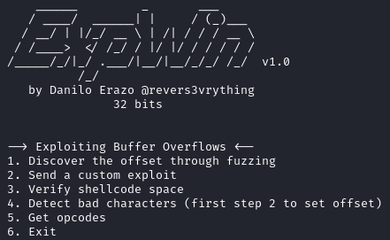
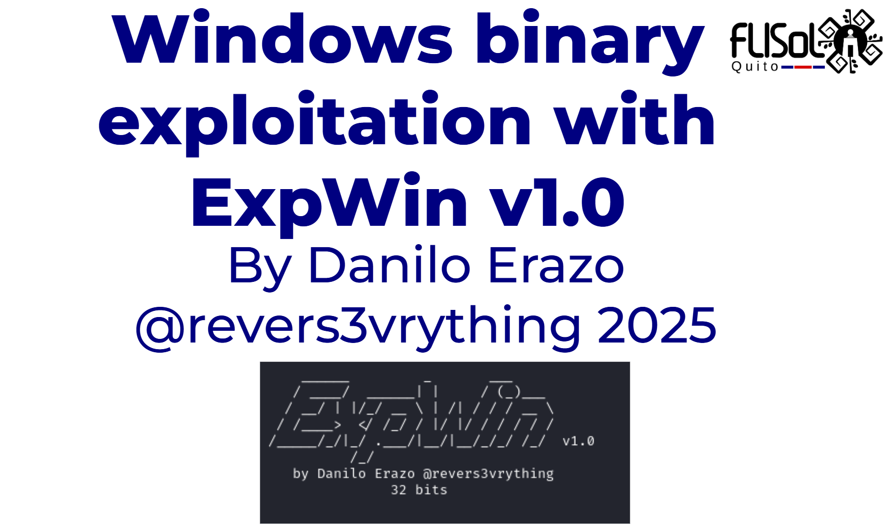

# ExpWin: Buffer Overflow Exploit Builder (Early Version)


## 📜 Description
This tool helps automate the process of building exploits to target **Buffer overflow vulnerabilities** in Windows binaries.

Currently, the tool is in its **first development phase**: it does **not** interact directly with memory or any debugger. Instead, it assists exploit writers by **simplifying and speeding up the process of crafting their initial exploit scripts**.

## 📦 Requirements
- Python 3 (recommended to run inside a virtual environment)
- Install required Python modules:
  ```bash
  pip install keystone-engine
  pip install numpy

- Run the tool in a Kali Linux machine

## How to Use


Please refer to the conference presentation showcasing this tool:
-   https://www.youtube.com/watch?v=pe3yye_dfjo

## Disclaimer
This tool is intended only for educational and ethical hacking purposes.
The creator is not responsible for any misuse of this tool.

## Author
By Danilo Erazo
This tool was presented at FLISoL Quito 2025.

